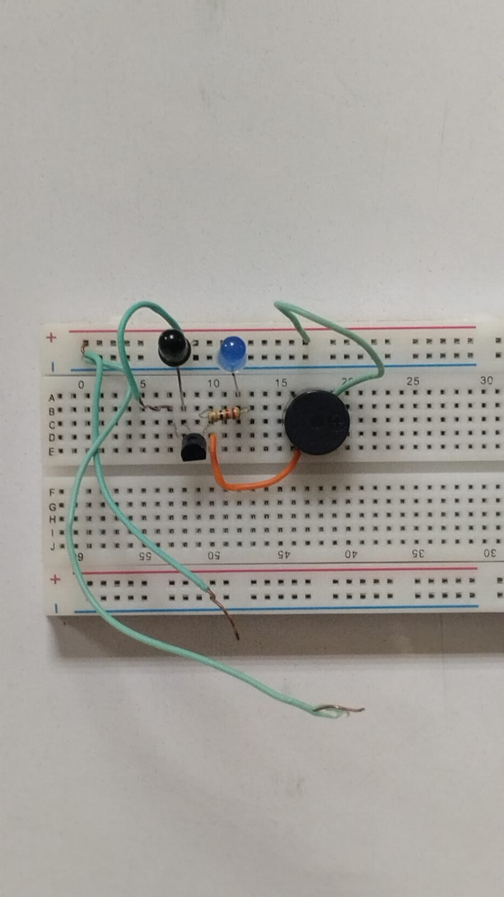
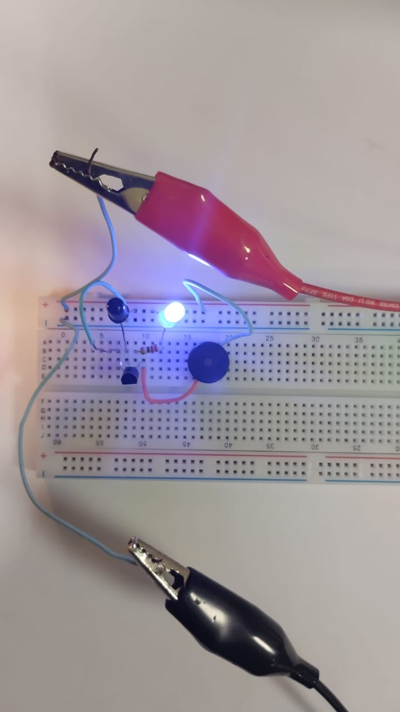

# 🔌 Analog Transistor-Based Fire Alarm — Hardware Implementation

A simple, microcontroller-free fire/smoke alarm circuit built on a breadboard using transistor switching logic. When smoke or fire is detected by a sensor, a transistor switches ON, triggering a buzzer and lighting an LED.

---

## 🖼️ Hardware Photos

| Build | In Operation |
|-------|-------------|
|  |  |

> **Image 2:** Circuit assembled on breadboard — IR sensor, blue LED, transistor, resistor, and buzzer visible.
> **Image 3:** Circuit powered and operating — blue LED glowing, indicating alarm triggered state.

---

## ⚙️ How It Works

```
[IR / Light Sensor]
        │
        ▼
[NPN Transistor — Switching Stage]
        │
   ┌────┴────┐
   ▼         ▼
[Buzzer]   [Blue LED]
  Alarm     Indicator
```

1. **Detection:** An IR sensor or light-dependent element monitors for smoke/fire.
2. **Switching:** When the sensor output crosses a threshold, the transistor (NPN) switches from cut-off to saturation — turning ON.
3. **Alarm:** The buzzer sounds and the blue LED lights up, signaling a fire/smoke event.
4. **Reset:** When smoke clears, the sensor output drops, the transistor switches OFF, and the alarm stops.

---

## 🧰 Components Used

| Component | Quantity | Purpose |
|-----------|----------|---------|
| NPN Transistor (e.g. BC547) | 1 | Switching element — core logic |
| IR Sensor / LDR | 1 | Smoke/fire detection |
| Buzzer | 1 | Audible alarm |
| Blue LED | 1 | Visual alarm indicator |
| Resistor (1kΩ) | 1 | Base current limiting for transistor |
| Resistor (220Ω) | 1 | LED current limiting |
| Breadboard | 1 | Circuit assembly |
| Jumper Wires | Several | Connections |
| Power Supply (5V) | 1 | Via alligator clip leads |

---

## 🔬 Working Principle (Transistor Logic)

The NPN transistor operates as a switch:

```
Normal (No smoke):
  Sensor → LOW signal → Base voltage < 0.7V → Transistor OFF → No alarm

Alarm (Smoke detected):
  Sensor → HIGH signal → Base voltage > 0.7V → Transistor ON (saturation) → Buzzer + LED ON
```

The base resistor (1kΩ) limits the base current to keep the transistor in safe operating range:

```
I_base = (V_in - V_BE) / R_base = (5 - 0.7) / 1000 ≈ 4.3 mA
```

---

## 📐 Circuit Description

- **Power:** 5V supplied via alligator clip leads to breadboard rails
- **Sensor output** → NPN transistor **Base** (through 1kΩ resistor)
- **Transistor Collector** → Buzzer (+) and LED anode (through 220Ω)
- **Transistor Emitter** → GND
- **Buzzer (–)** → GND
- **LED cathode** → GND

---

## ✅ Advantages of Analog Design

- No microcontroller needed — extremely low cost
- Fast response — no software delay
- Works without programming knowledge
- Reliable and simple to debug

---

## 🔗 Related

- 👉 [Arduino Simulation Implementation](../arduino-simulation/README.md)
- 👉 [Combined Troubleshooting Guide](../TROUBLESHOOTING.md)
