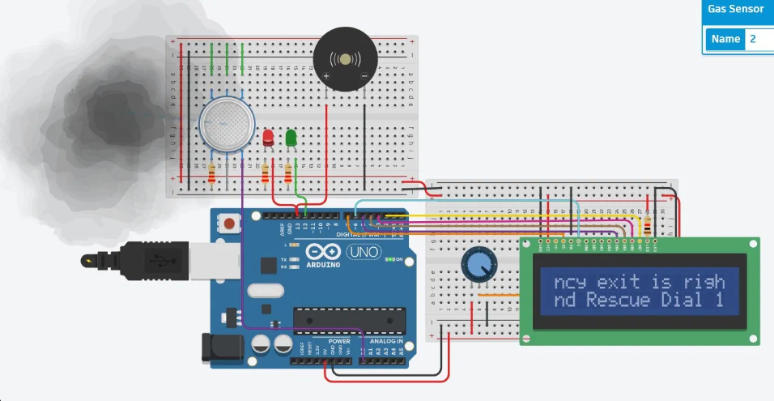

# 💻 Arduino-Based Fire Alarm — Tinkercad Simulation

A digital, Arduino-powered fire and smoke alarm system simulated on **Autodesk Tinkercad**. Uses an MQ-2 gas sensor to detect smoke, triggers a buzzer and LEDs, and displays an emergency message on a 16x2 LCD screen.

---

## 🖼️ Simulation Screenshot



> LCD displays scrolling emergency message (e.g. `"Emergency exit is right... Rescue Dial 1"`), red/green LEDs indicate alarm state, and the buzzer sounds on detection.

---

## ⚙️ How It Works

```
[MQ-2 Gas Sensor — Analog Pin A0]
              │
              ▼
     [Arduino UNO]
              │
    ┌─────────┼──────────┐
    ▼         ▼          ▼
[Buzzer]  [Red LED]  [16x2 LCD]
 Alarm    Danger     Scrolling
          Indicator  Emergency
                     Message
              │
         [Green LED]
          Safe indicator
```

1. **Detection:** MQ-2 gas sensor reads analog smoke level on pin A0.
2. **Threshold Check:** Arduino compares reading against a set threshold value.
3. **Alarm Trigger:** If smoke exceeds threshold — buzzer ON, red LED ON, green LED OFF.
4. **LCD Message:** LCD scrolls an emergency message with exit instructions.
5. **Safe State:** If below threshold — buzzer OFF, green LED ON, LCD shows "Air Quality: OK".

---

## 🌡️ Detection Logic

| Smoke Level (Analog) | State | Buzzer | Red LED | Green LED | LCD Message |
|----------------------|-------|--------|---------|-----------|-------------|
| < 300 (threshold) | Safe | OFF | OFF | ON | `Air Quality: OK` |
| ≥ 300 (threshold) | ALARM | ON | ON | OFF | `Emergency exit is right... Rescue Dial 1` |

---

## 🧰 Components Used (Tinkercad Simulation)

| Component | Quantity | Purpose |
|-----------|----------|---------|
| Arduino UNO | 1 | Main microcontroller |
| MQ-2 Gas Sensor | 1 | Smoke / gas detection |
| Buzzer | 1 | Audible alarm |
| Red LED | 1 | Danger indicator |
| Green LED | 1 | Safe / normal indicator |
| 16x2 LCD Display | 1 | Scrolling emergency message |
| Potentiometer | 1 | LCD contrast adjustment |
| Resistors (220Ω) | 2 | LED current limiting |
| Breadboard | 2 | Circuit assembly |
| Jumper Wires | Multiple | Connections |
| Power Supply (5V) | 1 | Via Arduino USB |

---

## 💻 Arduino Code

The full sketch is in the `/src` folder:

```
/src
  └── fire_alarm.ino
```

### Code Logic Summary

```cpp
int smokeLevel = analogRead(GAS_SENSOR_PIN);

if (smokeLevel >= THRESHOLD) {
    // ALARM STATE
    digitalWrite(BUZZER_PIN, HIGH);
    digitalWrite(RED_LED, HIGH);
    digitalWrite(GREEN_LED, LOW);
    lcd.print("!! FIRE ALARM !!");
    scrollEmergencyMessage();
} else {
    // SAFE STATE
    digitalWrite(BUZZER_PIN, LOW);
    digitalWrite(RED_LED, LOW);
    digitalWrite(GREEN_LED, HIGH);
    lcd.print("Air Quality: OK ");
}
```

---

## 📁 Folder Structure

```
arduino-simulation/
├── src/
│   └── fire_alarm.ino
├── simulation/
│   └── tinkercad_simulation.png
└── README.md
```

---

## 🚀 Getting Started

### Tinkercad Simulation
1. Open [Autodesk Tinkercad](https://www.tinkercad.com)
2. Recreate the circuit from the simulation screenshot
3. Paste `fire_alarm.ino` into the code editor
4. Click **"Start Simulation"**
5. Click the MQ-2 sensor and adjust the smoke slider to trigger the alarm

### Real Hardware
1. Wire components as shown in the simulation screenshot
2. Open `fire_alarm.ino` in **Arduino IDE**
3. Install **LiquidCrystal** library if needed
4. Upload to Arduino UNO
5. Open Serial Monitor at **9600 baud** to monitor readings

---

## 🔗 Related

- 👉 [Analog Hardware Implementation](../analog/README.md)
- 👉 [Combined Troubleshooting Guide](../TROUBLESHOOTING.md)
